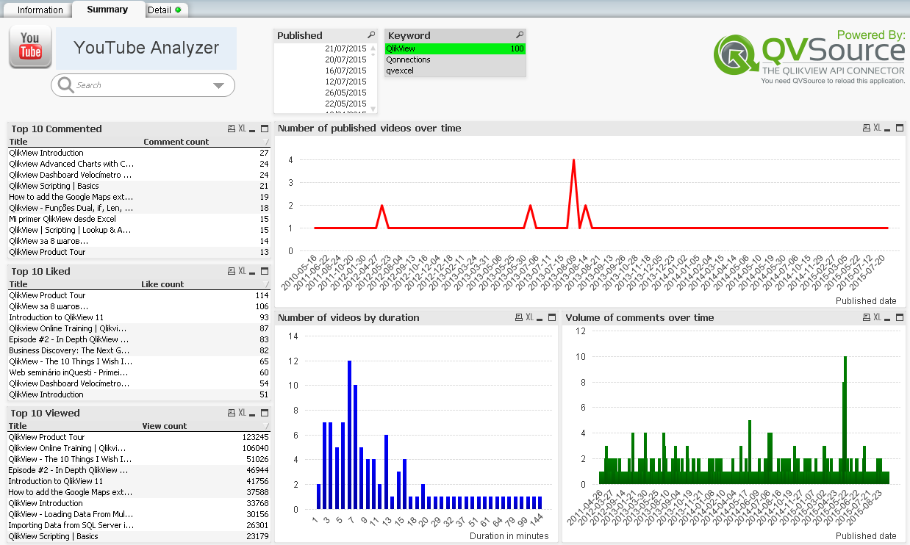

YouTube Starter App
===================
This is a starter QlikView application showing how to get started using the [QVSource YouTube Connector V3](http://wiki.qvsource.com/YouTube-Connector-For-QlikView-And-Qlik-Sense-(v3).ashx) for QlikView. 

Full documentation for this starter application can be found [here](http://wiki.qvsource.com/YouTube-Connector-For-QlikView-Demo.ashx).

If you are a QlikView + QVSource user you can simply click the ["Download ZIP"] (https://github.com/QVSource/QVSource-YouTube-Starter-App-For-QlikView/archive/master.zip) button on GitHub to grab this application.

The content below is copied from the change log in the first tab of the load script.

1.6.0 - 21/09/15
----------------
* Updated to use Connector V3.
* Note some data is no longer supported so some tables/columns have been removed.

1.5.3 - 17/06/14
----------------
* Changed the keyword listbox on the Summary tab (which was empty) to show YouTube search term.
* Changed Search_uploaded_qvdate (which no longer existed) to Search_published_qvdate on chart 'Number of uploaded Videos over time'.
* Changed count(Comments_published_qvdate) to count(Comments_id) on chart 'Volume of Comments'.
* Changed Count(Insights_world_locations_Date) to Sum(Insights_world_locations_Views) on object now called 'World Location Views'.
* Dimension for Video Lengths charts changed to '=floor(Search_duration/60)' and changed expression to 'sum(Search_statistics_viewCount)'.
* Updated remaining badges.

1.5.2 - 04/12/12
----------------
* Updated badge.

1.5.1 - 08/07/12
----------------
* Added change log.
* Moved to YouTube Connector V2 (some column nane changes).
* Config now in separate Config.txt file.
* Moved to QVX format.
* Moved script into separate tabs/functions.
* Commented out keywords table for the time being as the value always appears to be empty in the API response (<media:keywords/>)
* Added check that QVSource is running.
* Added appId parameter to calls.
* Added to GitHub.

TODO
----
Some ideas which would improve this application.
* Accumulate results into QVD file(s).
* Download comments using the new Async feature (http://www.qvsource.com/wiki/Synchronous-Asynchronous-And-Batch-Requests-Explained.ashx).
* Add sentimnent analysis.
* Add automatic pagination through blocks of insights results (because you can currently only specify a single time span of no more than 31 days).
* Add Channel Insights tables.
